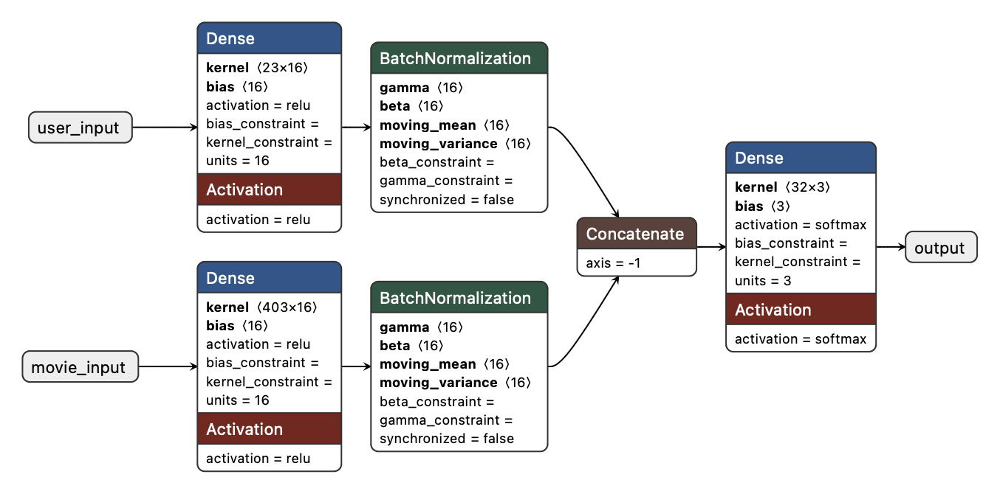

# Movie Recommendation System

This project builds a **Movie Recommendation System** using deep learning techniques. The model takes in user preferences and movie information to recommend top movie choices. The system uses a combination of **Collaborative Filtering** and **Content-Based Filtering** to suggest movies based on user interactions and movie features.

## Table of Contents

1. [Project Overview](#project-overview)
2. [Data Preprocessing](#data-preprocessing)
3. [Model Architecture](#model-architecture)
4. [Installation](#installation)
5. [Technologies Used](#technologies-used)
6. [Contributors](#contributors)

## Project Overview

The movie recommendation system is built using **TensorFlow** and **Keras**, which allows us to utilize deep learning models to predict movie ratings for unseen user-movie pairs. The model combines both **user features** and **movie features** to generate recommendations. 

Key features:
- Movie titles processed using **Sentence Transformers** to generate semantic embeddings.
- Movie genres encoded using **One-Hot Encoding** to represent categorical genres.
- User data including demographic and preference features are normalized and used in the model.

## Data Preprocessing

The data used in this project comes from a dataset containing user-movie interactions, movie metadata, and user demographics. Several preprocessing steps were carried out to ensure that the data is ready for the deep learning model.

### 1. User Features: Age, Gender, and Occupation Encoding
The user features include demographic information and user preferences. These features are processed using various encoding and scaling techniques.

- **Age**: The `bucketized_user_age` feature is normalized using a **StandardScaler** to scale the values to a range suitable for deep learning models.
  
- **Gender**: The `user_gender` feature is encoded as a binary value (0 for male, 1 for female) using **integer encoding**.
  
- **Occupation**: The `user_occupation_text` feature is one-hot encoded using **OneHotEncoder**, which transforms the categorical occupation data into binary columns.

- **Rating**: The `user_rating` target is mapped into ***3 Values***, rating between `[1, 2]: Low`, `[3]: Medium` and `[4, 5] High`

The processed user features are then combined into a single vector that can be fed into the model.

### 2. Movie Features: Genres and Titles
The movie features are processed by transforming categorical movie data (genres) and textual movie data (titles) into numerical representations suitable for deep learning models.

- **Genres**: The `movie_genres` feature is processed by first mapping genre IDs to their string representations using a predefined `genre_map`. Then, the genres are one-hot encoded using the **MultiLabelBinarizer**.
  
- **Titles**: Movie titles are transformed into dense vector representations using **Sentence Transformers**. The model `all-MiniLM-L6-v2` is used to encode each movie title into a semantic embedding that captures the meaning of the title in a fixed-size vector.


### 3. Data Split: Train and Test Sets
The data was split into training and testing sets (80% training, 20% testing). This allowed for proper model evaluation and ensured that the model generalizes well to new data.

## Model Architecture

The recommendation model is a **deep neural network** that takes in both user and movie features to predict the rating a user would give to a movie. The architecture includes:

1. **User Input and Embedding**:
   - The user features are fed into a dense layer with **ReLU activation** followed by **batch normalization**.

2. **Movie Input and Embedding**:
   - Similarly, the movie features are processed through a dense layer with **ReLU activation** and **batch normalization**.

3. **Concatenation**:
   - The user and movie embeddings are concatenated together to form a combined feature vector.

4. **Output Layer**:
   - The combined feature vector is passed to a final output layer with a **softmax activation**, producing a probability distribution across 3 classes (representing ratings from 1 to 5).

The model is trained using **categorical cross-entropy loss** and the **Adam optimizer**. The training process involves:
- Using **ModelCheckpoint** to save the best model based on validation loss.
- Using **EarlyStopping** to prevent overfitting by stopping training when validation loss does not improve for a specified number of epochs.

The model’s architecture is presented in this image


<p align="center">
    
</p>


## Model architecture code example

```python
user_feature_dim = user_features.shape[1]
movie_feature_dim = movie_features.shape[1]

# User input and embedding
user_input = layers.Input(shape=(user_feature_dim,), name="user_input")
user_embedding = layers.Dense(16, activation='relu')(user_input)
user_embedding = layers.BatchNormalization()(user_embedding)

# Movie input and embedding
movie_input = layers.Input(shape=(movie_feature_dim,), name="movie_input")
movie_embedding = layers.Dense(16, activation='relu')(movie_input)
movie_embedding = layers.BatchNormalization()(movie_embedding)

# Combine user and movie embeddings
combined = layers.Concatenate(name="concatenate")([user_embedding, movie_embedding])

# Output layer with 3 classes
output = layers.Dense(3, activation='softmax', name="output")(combined)

# Final model
model = Model(inputs=[user_input, movie_input], outputs=output)
model.compile(optimizer='adam', loss='categorical_crossentropy', metrics=['accuracy'])
```

## Installation

1. Clone the repository:

    ```bash
    git clone git@github.com:AmineMrabet12/Multi-Tower-Model.git
    ```

2. Navigate to the project directory:

    ```bash
    cd Multi-Tower-Model
    ```

3. Install the required dependencies:

    ```bash
    pip install -r requirements.txt
    ```
4. Project Tree
    ```bash
    .
    ├── code
    │   ├── load_data.py
    │   ├── preprocess.py
    │   └── train.py
    ├── data
    │   └── movielens.csv
    ├── models
    │   ├── MT-Model.h5
    │   └── best_model.keras
    ├── notebooks
    │   ├── explore_data.ipynb
    │   ├── load_data.ipynb
    │   └── test.ipynb
    ├── README.md
    └── requirements.txt
    ```

## Technologies Used
[](https://www.tensorflow.org/)
[](https://keras.io/)
[](https://scikit-learn.org/)
[](https://pandas.pydata.org/)
[](https://numpy.org/)
[](https://github.com/UKPLab/sentence-transformers)

## Contributors
- [Amine Mrabet](https://github.com/AmineMrabet12)
- [Vinay Kular](https://github.com/Vinaykumarx)